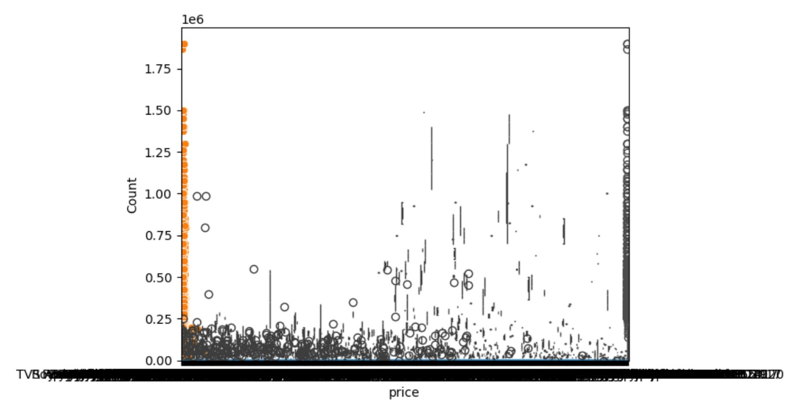
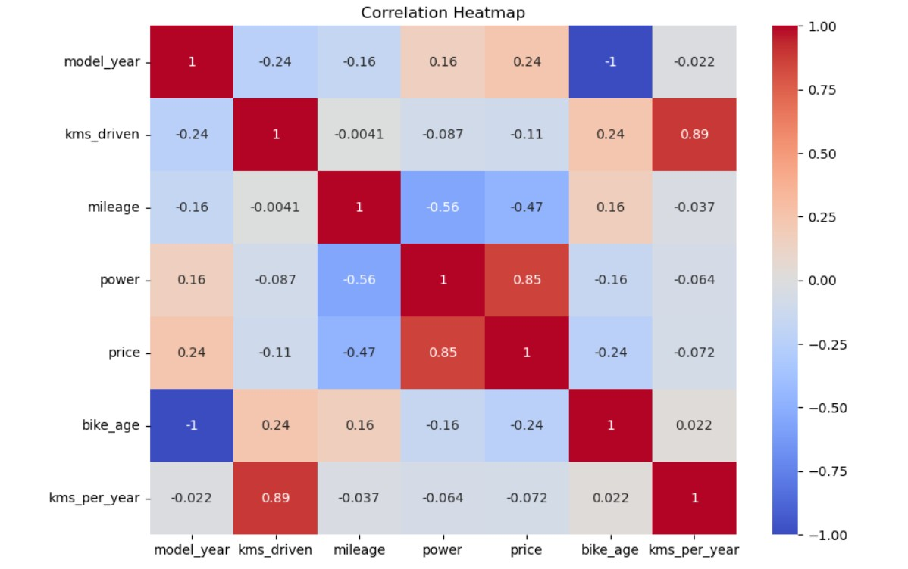
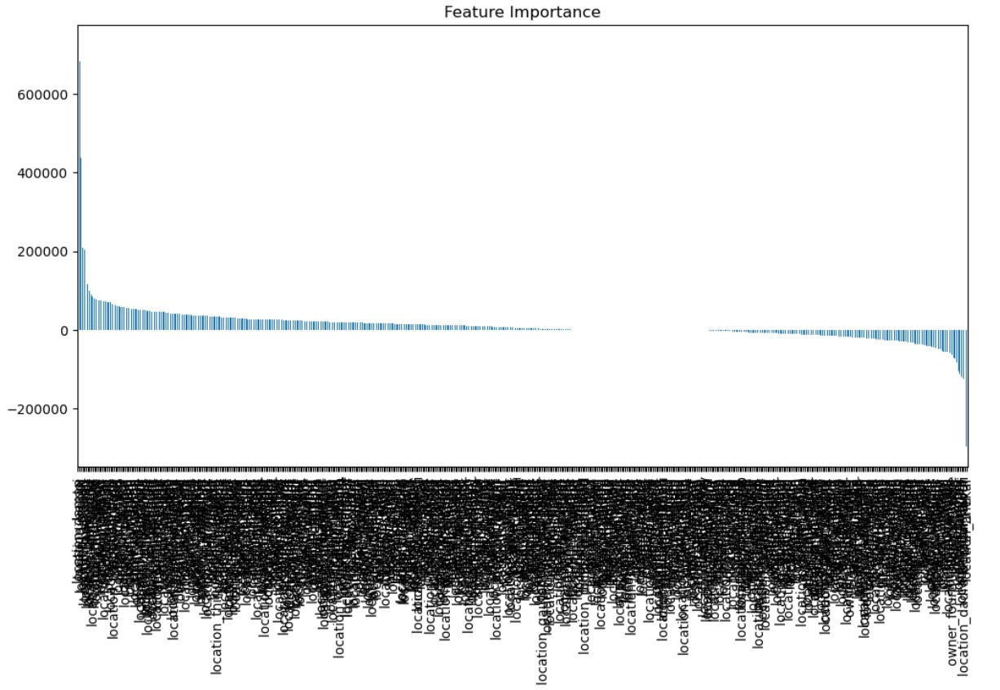

#  Used Bike Price Prediction – Machine Learning Project

A complete end-to-end ML project to predict the selling price of used bikes based on various attributes like power, mileage, kms driven, and more. Built using Python, Pandas, Scikit-learn, and Jupyter Notebook.

---

## Problem Statement

Predict the fair market value of a used bike based on its features to help sellers price their bikes better and help buyers make informed decisions.

---

##  Dataset Overview

The dataset contains historical data of used bikes sold in India, including:
- `model_name`: Model and variant
- `model_year`: Year of manufacture
- `kms_driven`: Total kilometers ridden
- `owner`: Ownership type (First, Second, etc.)
- `mileage`, `power`: Engine performance
- `location`: City of sale
- `price`: Selling price (target)

---

## 🧹 Data Cleaning & Feature Engineering

-  Removed units from columns like `'power'`, `'mileage'`, `'kms_driven'`
-  Created new features: 
  - `bike_age = 2025 - model_year`
  - `kms_per_year = kms_driven / bike_age`
-  One-hot encoded categorical variables like `owner` and `location`
-  Removed missing and duplicate rows for clean input to model

---

##  Exploratory Data Analysis (EDA)

Here are key visuals from our analysis:

###  Price Distribution

###  Correlation Heatmap

###  Owner Type vs Price

###  Feature Importance

---

##  Model Building

- Trained a **Linear Regression** model on 80% of the data
- Evaluation Metrics:
  - `Mean Squared Error (MSE) ≈ 4.53e+08`
  - `R² Score ≈ 0.78` (78% accuracy on test data)

---

## 💻 Technologies Used

- Python (Pandas, NumPy, Seaborn, Matplotlib)
- Scikit-learn
- Jupyter Notebook
- GitHub for version control
